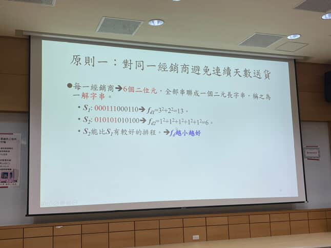
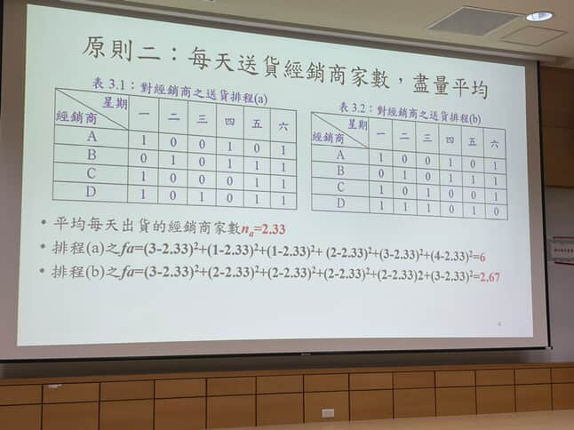
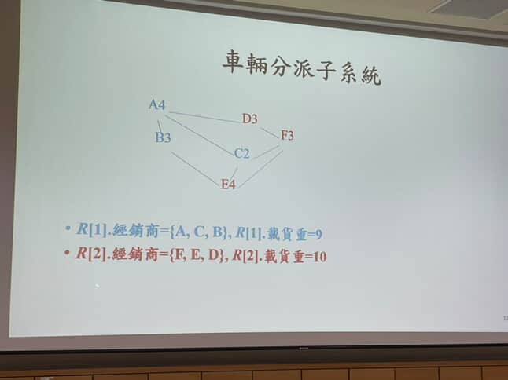
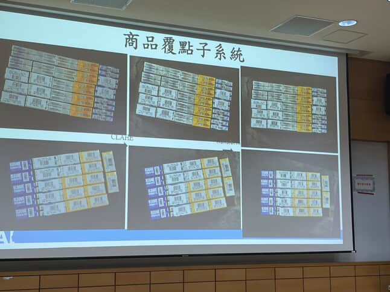

# 📝 演講書面報告

## 👦 學生
四資工四甲 41043129 林傳勝
## 📅 日期
2025年5月13日
## 🎙️ 講者
中興大學資管系 終身特聘教授 詹永寬
## 📝 題目
AI的運用範例

## 💡 心得報告

詹永寬教授以「AI的運用範例」為題，介紹應用於物流出貨配送優化領域的實務研究與系統設計。詹教授透過一套具體的「物流出貨運送管理系統」為例，說明如何利用人工智慧與演算法解決大型複雜的配送問題，內容涵蓋了出貨排程、車輛分派、最短路徑計算與商品覆點子系統設計，並深入探討其中的數學公式與工程考量。

首先，在出貨排程子系統方面，該代理商擁有超過2000家經銷商與約40輛小貨車，配送作業僅限每週一至週六。經銷商按重要性或需求量區分為不同等級，每週需配送1至4次不等。為了提升物流效率與公平性，排程需遵守兩項核心原則：其一，對同一經銷商避免連續送貨日，以減少庫存壓力與人員負擔；其二，每日出貨的總經銷商數應盡量平均分布，避免某日工作量過高。

詹教授以6個二位元字串表示排程方案，例如 $S_1:000111000110$ ，其計算適應度 $f_a = 3^2 + 2^2 = 13$，而另一方案 $S_2:010101010100$ 對應 $f_a = 1^2 + 1^2 + 1^2 + 1^2 + 1^2 + 1^2 = 6$，顯然越分散者 $f_a$ 越小越佳。此設計方式類似於基因演算法的染色體編碼[1]。

其次，針對每日配送經銷商家數的均衡性，詹教授以最小平方差為衡量指標，記為 $f_b$。此值越小表示每日的出貨數量越接近平均。舉例來說，兩個排程方案在每日平均出貨量為 2.33 次的情況下，分別得到 $f_b = 6$ 與 $f_b = 2.67$，顯示第二個排程分配更均勻。與經銷商送貨分散程度對應的 $f_a$ 指標一起，詹教授定義了一個綜合性的排程適應度函數： $$ f_s = \frac{1}{\sqrt{f_a \times f_b}}$$ 此處以幾何平均而非算術平均來整合兩個指標，是因為當 $f_a$ 與 $f_b$ 差距甚大時，幾何平均能避免其中一項過度主導結果。這種融合多個指標後進行倒數轉換的方式，不僅有理論上的可解釋性，也在多目標優化領域中被廣泛應用，特別是在物流與供應鏈決策情境[2]。

車輛分派子系統則將經銷商依據地理與貨量分配給各車輛，演講範例中展示兩車分派結果為 $R[1]={A,C,B}$、總貨重9與 $R[2]={F,E,D}$、總貨重10，力求載重均衡與路線合理化。這個問題對應於「帶容量限制的車輛路由問題（CVRP）」，為NP-Hard問題，通常以貪婪法、群體智慧（如螞蟻演算法）等近似方法解決[3]。

第四個子系統為商品覆點子系統，採用電腦視覺結合影像辨識與條碼辨識技術，自動檢查商品種類與數量是否正確，減少人為錯誤並提高出貨準確率。影像識別已在智慧物流中成為主流技術，常結合深度學習模型應用於包裝檢查、箱內識別與物料追蹤等場景[4][5]。

詹教授最後分享其對AI系統設計的哲學：「Simple is Good」。在研究與實作中，他強調簡單的方法往往更穩定、效率更高。複雜度高的NP問題若一味追求精確，常導致資源浪費與執行不穩定，反而透過簡化問題策略更能達到實務可行的最佳解。

本次演講內容不僅闡述了AI如何實際嵌入企業物流運作，更展示演算法設計與理論應用的緊密結合。身為資訊工程系的學生，我從中體會到將演算法落實到實際場景時，除了數學公式的嚴謹，還需考慮企業流程、成本、人力等綜合因素，而「Simple is Good」正是解決複雜問題的關鍵。

## 🔑 關鍵字
物流排程、NP-Hard問題、基因演算法、電腦視覺、配送優化、簡單原則

## 📖 參考文獻
1. Harun, S., & Ibrahim, M. F. (2019). A genetic algorithm based task scheduling system for logistics service robots. Bulletin of Electrical Engineering and Informatics, 8(1), 1437.
2. Kmiecik, M. (2025). Creating a genetic algorithm for third-party logistics’ warehouse delivery scheduling via a large language model. Journal of Modelling in Management.
3. Greenberg, I., Sielski, P., Linsenmaier, H., Gandham, R., Mannor, S., Fender, A., Chechik, G., & Meirom, E. (2025). Accelerating Vehicle Routing via AI-Initialized Genetic Algorithms. arXiv preprint arXiv:2504.06126.
4. Deloitte. (2024). 'Tech Is in Our DNA': The Colruyt Group Keeps It Cool With Automation. The Wall Street Journal.
5. Xu, J., Wu, H., Cheng, Y., Wang, L., Yang, X., Fu, X., & Su, Y. (2024). Optimization of Worker Scheduling at Logistics Depots Using Genetic Algorithms and Simulated Annealing. arXiv preprint arXiv:2405.11729.